# Kỹ thuật Bypass Windows Defender
### DLL Sideloading

---

## Tóm tắt

Bypass Windows Defender AV trên Windows bằng cách khai thác cơ chế tìm kiếm thư viện (DLL Search Order) của hệ điều hành Windows.

**Môi trường thực thi:**
- Windows 10
- Kali Linux
  
**Công cụ sử dụng:**
- PE-Bear
- Process Monitor
- xdbg debugger
- msfvenom
- metasploit-framework

---

## 1. Tổng quan

### 1.1 DLL Search Order

Trên hệ thống Windows, khi một ứng dụng được thực thi và cần các thư viện DLL cụ thể, hệ điều hành sẽ sử dụng một cơ chế gọi là **DLL Search Order** để tìm và nạp (load) thư viện cần thiết.

Nếu `SafeDllSearchMode` bị **tắt**, thứ tự tìm kiếm DLL sẽ như sau:

- Thư mục chứa file thực thi của ứng dụng (thư mục chứa file .exe).
- Current Working Directory (CWD).
- Thư mục System (System32).
- Thư mục hệ thống 16-bit (System).
- Thư mục Windows.
- Các thư mục được khai báo trong biến môi trường PATH.

Khi `SafeDllSearchMode` được **bật** (mặc định), thứ tự tìm kiếm thay đổi thành:

- Thư mục chứa file thực thi của ứng dụng.
- Thư mục System (System32).
- Thư mục hệ thống 16-bit (System).
- Thư mục Windows.
- Current Working Directory (CWD).
- Các thư mục trong biến môi trường PATH.

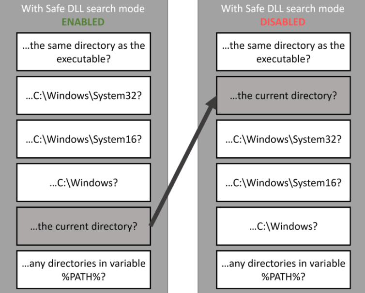

---

### 1.2 DLL Sideloading

DLL Sideloading là kỹ thuật khai thác cơ chế tìm kiếm DLL của Windows để buộc ứng dụng hợp lệ nạp một DLL do attacker kiểm soát, có cùng tên với DLL hợp lệ mà ứng dụng yêu cầu.

---

### 1.3 Antivirus phát hiện chương trình đáng ngờ như thế nào?

Phần mềm Antivirus thường sử dụng cơ chế phát hiện nhiều lớp (multi-layered detection engine).

Nhiều giải pháp AV hiện đại sử dụng hệ thống chấm điểm (ví dụ: 0–100) để đánh giá mức độ nghi ngờ của một chương trình. Điểm càng cao, khả năng bị coi là mã độc càng lớn.

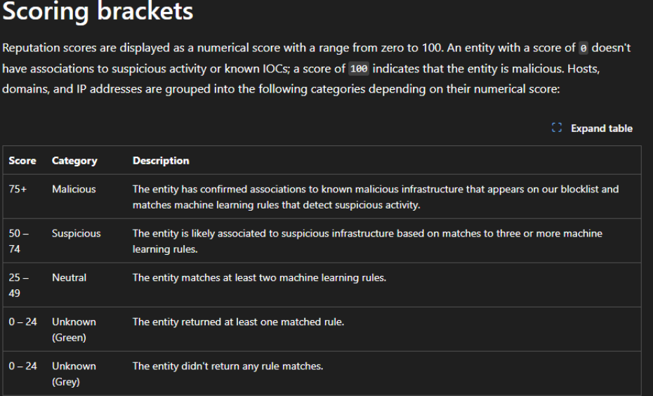

---

### Tiêu chí chấm điểm của AV

#### 1. Signature-based Detection

- Phương pháp truyền thống dựa trên mẫu mã độc đã biết.
- So khớp hash file (MD5 / SHA1 / SHA256) với cơ sở dữ liệu malware.
- So khớp mẫu byte tĩnh (static byte-pattern matching).
- Phát hiện chuỗi độc hại hoặc indicator được hardcode.
- Phát hiện packer phổ biến thường dùng trong malware.

#### 2. Behavior-based Detection

- Tạo file hoặc process đáng ngờ.
- Inject vào process khác.
- Thực thi từ thư mục bất thường (Temp, AppData…).
- Tải file từ Internet.
- Thay đổi registry (đặc biệt các key liên quan đến persistence).
- Tạo scheduled task hoặc service.
- Quan hệ parent-child process bất thường.

**Để bypass AV, cần giảm thiểu số điểm bị tính dựa trên các tiêu chí này.**

---

### 1.4 Cách tìm cặp DLL có thể sideload

- Xác định DLL mà ứng dụng đang sử dụng.
- Kiểm tra các function được gọi khi ứng dụng load DLL.
- Thử chèn MessageBox vào function đó để kiểm tra.

Nếu ứng dụng chạy và hiển thị MessageBox, chứng tỏ cặp ứng dụng–DLL này có thể khai thác bằng kỹ thuật DLL Sideloading.

---

## 2. Proof of Concept

### 2.1 Tìm cặp DLL Sideload

Sử dụng Process Monitor để kiểm tra các DLL mà `GUP.exe` load.

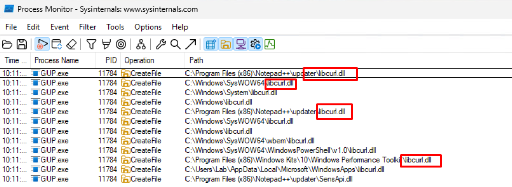

Quan sát thấy `GUP.exe` load một DLL có tên `libcurl.dll`. Thứ tự hiển thị cho thấy Windows đang tìm DLL theo cơ chế Search Order.

Tạo một DLL giả có cùng tên `libcurl.dll`, sau đó chạy lại `GUP.exe`.

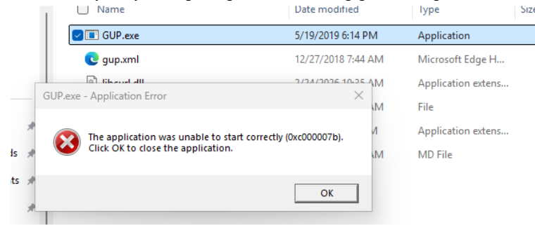

Khi dùng DLL giả (dummy DLL), ứng dụng load thành công nhưng báo lỗi “unable to start correctly”. Điều này cho thấy DLL không chứa đầy đủ function như DLL gốc.

Để xác định các function cần thiết, sử dụng công cụ PE-Bear.

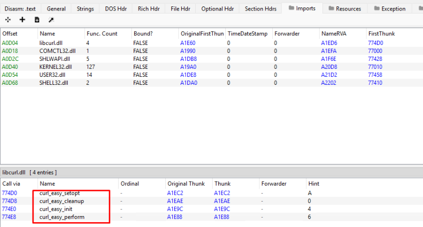

DLL gốc chứa 4 function cần thiết cho `GUP.exe`. Tiếp theo cần xác định function nào được gọi.

Sử dụng xdbg debugger để xác định function được gọi.

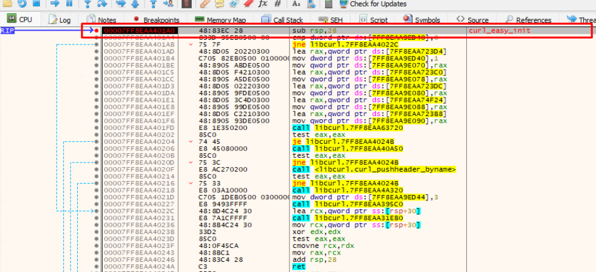

Đã xác định được function mà `GUP.exe` sử dụng.

---

### 2.2 Custom MessageBox trong function `curl_easy_init`

```
void* __cdecl curl_easy_init(void)
{
    MessageBoxA(
        NULL,
        "This DLL is Side-Loaded.",
        "Success",
        MB_OK | MB_ICONINFORMATION
    );

    return NULL;
}
```
Copy DLL đã build vào thư mục chứa GUP.exe cùng file `gup.xml`.
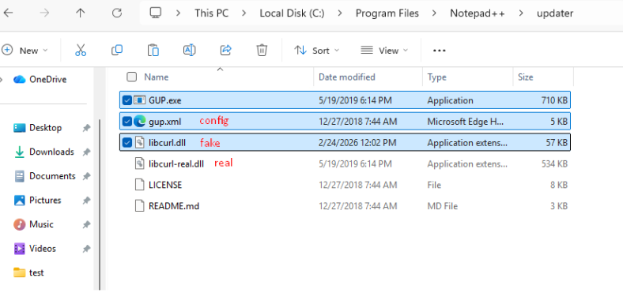

Khi thực thi GUP.exe, MessageBox xuất hiện:
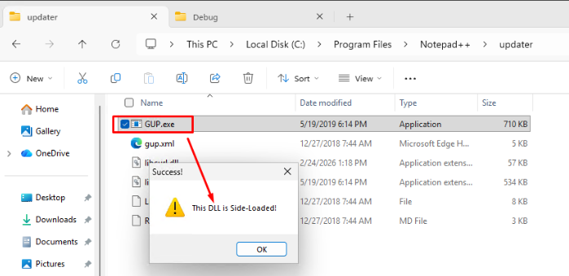


### 2.3 Custom payload kết nối C2
Tạo payload bằng msfvenom:
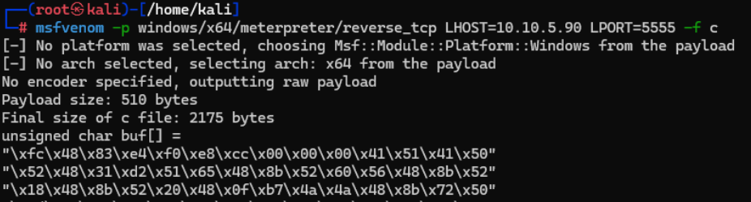

Custom function:
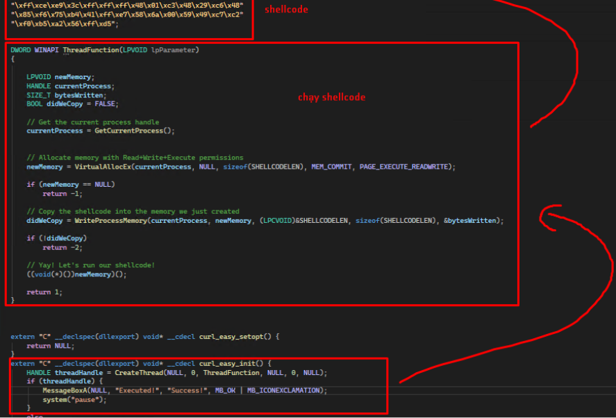

Khi thực thi GUP.exe, một session meterpreter được tạo:
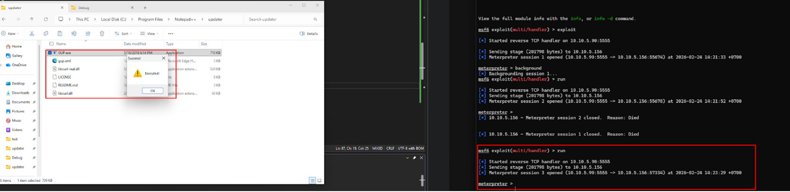

### 3. Demo PoC
[Watch video demo](https://youtu.be/IPLsn02-A5I)

# Cấu trúc Repository

```
PoC-DLL-Sideloading/
│
├── DLL-Sideload.md
└── images/
    └── *.png
```
